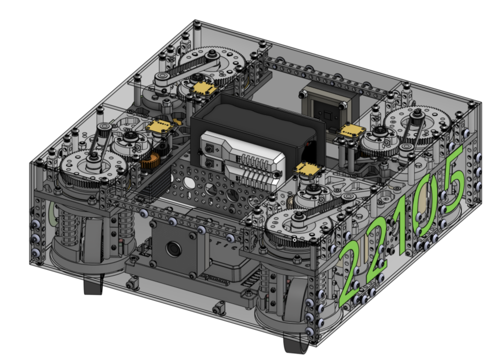

<!DOCTYPE html>
<html lang="en">
<head>
    <meta charset="UTF-8">
    <meta name="viewport" content="width=device-width, initial-scale=1.0">
    <title>Rahul Verma's 2024-2025 AP CSA Notebook</title>
    
</head>
<body>
    

        <h1>Welcome to Rahul Verma's 2024-2025 AP CSA Notebook!</h1>
    

    

        

            
Thank you for coming over to my website! Below I've listed some of my recent programming experiences that I'd like to highlight. If you want to learn more about me, head on over to my about me page.

        

        

            <h2>REHS</h2>
            
            

                Over the summer, I completed a research internship at the San Diego Computer Center called the UCSD Research Experience for High School Students. In a project called ICICLE in which our subproject was named PRISM, we benchmarked the runtimes and efficiencies of the computer vision models Tensorflow and Pytorch against various CPU and GPU cores. These benchmarks lay the foundation for running CV models on fields in Iowa (the focus of the project) efficiently and quickly to assist with agriculture. We are looking forward towards continuing working on this project and submitting our paper/poster to research conferences.
            

        

        

            <h2>USACO/ACSL</h2>
            
            

                I have been preparing and competing in the USA Computing Olympiad (USACO) and American Computer Science League (ACSL) in recent years-- computer science competitions focused around problem solving and algorithms. I have qualified for USACO Silver (and nearly USACO Gold..) and won the ACSL Silver Medal in the national senior competition over recent years. With this, I have just recently become the president of the Del Norte Algorithmic Coding Club and hope to further the progress of algorithmic programming at our school.
            

        

        

            <h2>FTC Robotics</h2>
            
            

                As co-captain of my robotics team, we developed a complex drivetrain this summer (see my about me page for more). This requires a lot more programming, which I assisted my software team in completing (Tarun Jaikumar and Aadit Mathur played the biggest part in this 🙂). We are hopeful to qualify for the World Championships and win awards there too.
            

        

        

            <h2>Gorrila Type 😋</h2>
            

            <input type="text" id="user-input" placeholder="Start typing here..." disabled>
            

        

    

    

        
&copy; 2024-2025 Rahul Verma. All rights reserved.

    

    
</body>
</html>