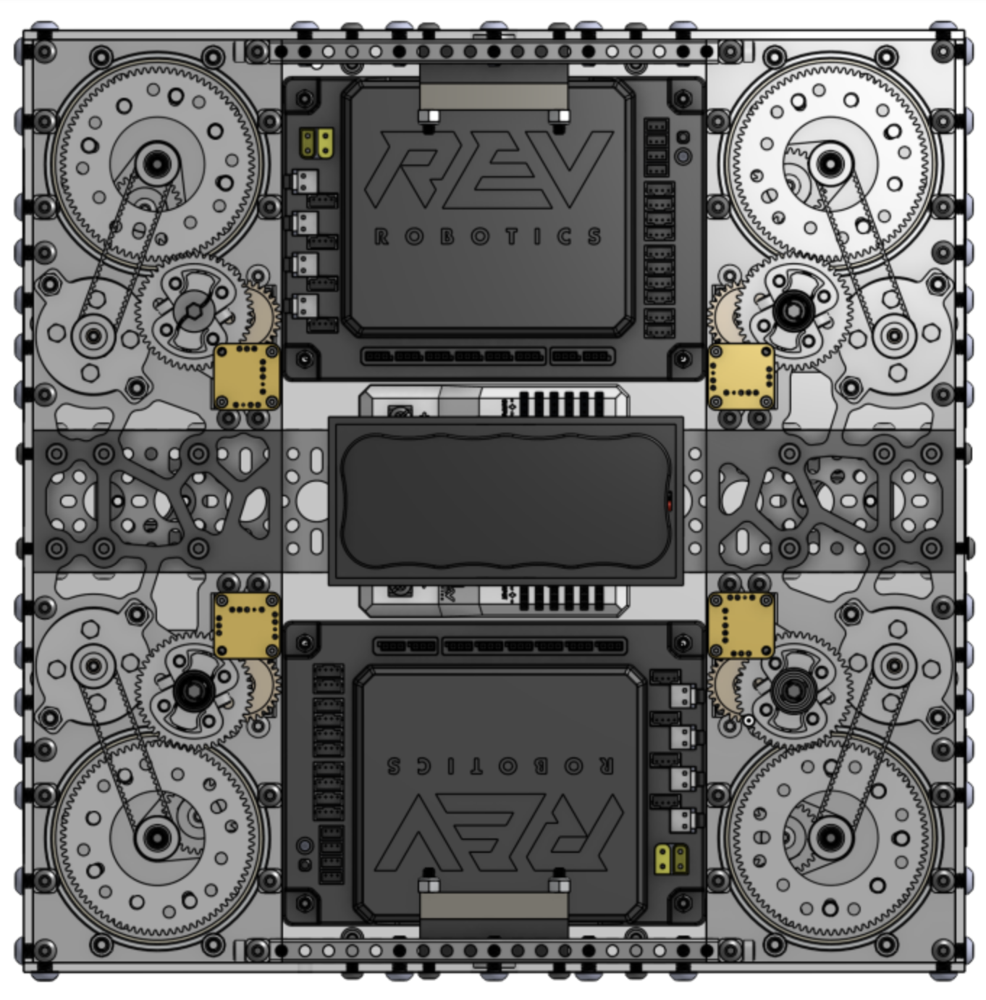
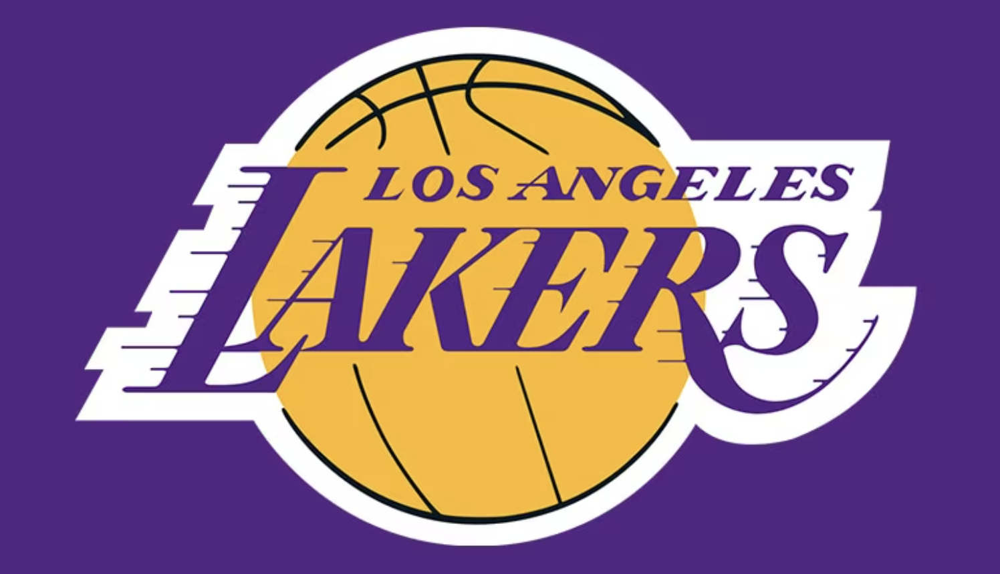

# All about Rahul Verma

Welcome to my AP CSA website! Here’s a little about myself:

## Interests and Activities

    

        
    

    

        <h3>Competitive Programming</h3>
        
I really enjoy programming problem solving in competitions like <a href="https://usaco.org" style="color: #9b59b6;">USACO</a> and <a href="https://www.acsl.org" style="color: #9b59b6;">ACSL</a>. I've been doing this for a few years and have really enjoyed learning this side of coding.

    

    

        
    

    

        <h3>Robotics</h3>
        
As a co-captain of my <a href="https://www.firstinspires.org/robotics/ftc" style="color: #9b59b6;">FTC</a> team, I take on a lot of responsibilities on the hardware side, and I also contribute to the programming. This past summer, we designed and built a suspension coaxial swerve drive, which was an exciting and challenging project!

    

    

        
    

    

        <h3>Basketball</h3>
        
I love playing basketball and am looking forward to making the varsity team this year, after being on JV last year. My favorite team is the Los Angeles Lakers, and are hopeful they can get back to their 2020 form and win a championship.

    

## Contact

Feel free to reach out to me at connect.rahulv@gmail.com for anything!

---
